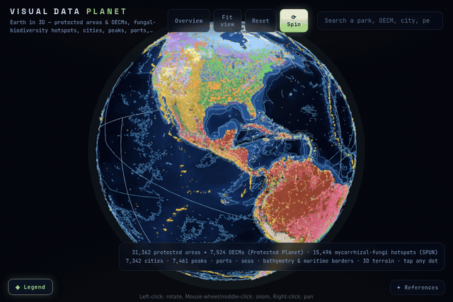

# Visual Data Planet — Earth's protected areas in 3D

[](https://vdata.liako.eu/planet/)
[-f4f4f4?style=flat)](LICENSE)
[](https://threejs.org)
[](DATA.md)
[](DATA.md)
[](https://www.protectedplanet.net)
[](DATA.md)
[](#running-locally)



**Live: [vdata.liako.eu/planet](https://vdata.liako.eu/planet/)**

Earth's protected areas on one interactive 3D globe — **31,362 sites**, a uniform sample of
the ~315,000-site **World Database on Protected Areas** (WDPA, UNEP-WCMC & IUCN,
[protectedplanet.net](https://www.protectedplanet.net)):

- Every dot is a real national park, strict reserve, natural monument, habitat area,
  protected landscape or marine sanctuary, at its true latitude/longitude —
  greens on land and coast, blues at sea
- Layers by IUCN management category (Ia·Ib → VI), plus the international designations:
  **UNESCO World Heritage**, **Ramsar wetlands**, **UNESCO-MAB biospheres**
- The **second Protected Planet database, WD-OECM** (7,524 Other Effective area-based
  Conservation Measures) as its own orange layer
- **3D terrain** — the globe carries real shaded relief (elevation displacement), so mountain
  ranges rise off the sphere
- Tap any dot for its data: name, designation, IUCN category, reported area, year
  established, country
- Search any park or reserve by name (Enter cycles matches); the camera flies to it
- Context in the HUD: 17.6% of land and 8.4% of the ocean are protected
  (Protected Planet)
- **Earth layers** for geographic context — **7,342 cities** (Natural Earth, coloured by
  population), **7,461 mountain peaks ≥ 3,500 m** (Wikidata, brighter = higher),
  **1,081 ports** and **295 named oceans & seas** (Natural Earth label points) — each
  tappable with its own panel, searchable, and toggleable in the legend

The mapping methodology — coordinate maths, sampling, centroid handling, and what is exact
versus approximate — is documented in [METHODS.md](METHODS.md); sources and citation in
[DATA.md](DATA.md).

## Running locally

No build step — plain JavaScript, [Three.js](https://threejs.org) and
[3d-force-graph](https://github.com/vasturiano/3d-force-graph) from CDN (pinned to matching
revisions — a mismatch makes textures sample black).

**The WDPA-derived data file is not shipped in this repository** (WDPA terms prohibit
redistribution). Generate it once, then serve:

```bash
node scripts/fetch-wdpa.mjs includes/js/planet-data.js
python3 -m http.server 8000   # → http://localhost:8000/
```

The earth layers file (`includes/js/planet-earth.js` — cities/peaks/ports/seas, public
domain + CC0) **is** shipped; rebuild it any time with `node scripts/fetch-earth-layers.mjs`.

## Licence

Code is [MIT](LICENSE). **Not covered**: the WDPA data (property of UNEP-WCMC & IUCN,
regenerate locally via the script above), Earth imagery (Solar System Scope, CC BY 4.0),
and the LIAKO name and branding.

Sister projects: [visual-data-cosmos](https://github.com/liakomedia/visual-data-cosmos) ·
[visual-data-solar](https://github.com/liakomedia/visual-data-solar) ·
[visual-data-art](https://github.com/liakomedia/visual-data-art) — compiled by
[Liako](https://liako.eu).
